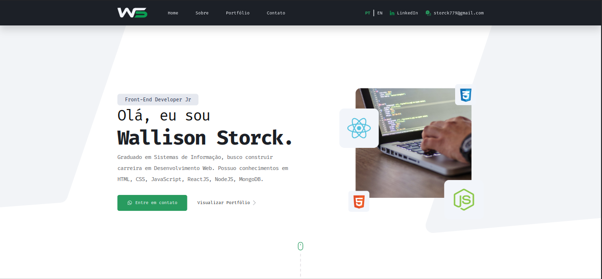
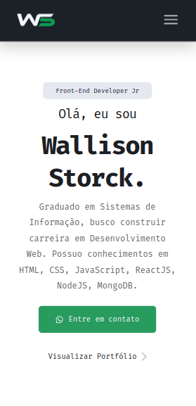
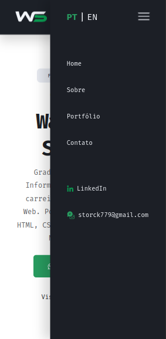
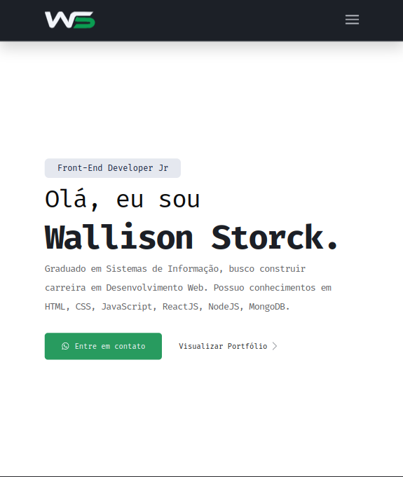
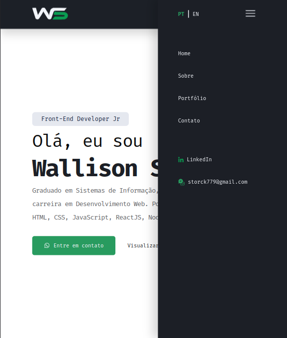

<h1 align="center">
  
</h1>

  <a href="#-projeto">Projeto</a>&nbsp;&nbsp;&nbsp;|&nbsp;&nbsp;&nbsp;
  <a href="#-tecnologias">Tecnologias</a>
 

 

  

  
  
  

  
  

  
  

 

## 💻 Projeto

Meu portfólio pessoal com áreas como:

- Apresentação
- Sobre mim
- Ferramentas
- Portfólio
- Contato

 

## ✨ Tecnologias

Esse projeto foi desenvolvido com as seguintes tecnologias:

- HTML
- CSS
  - FlexBox
  - Grid Layout
- JavaScript

---
